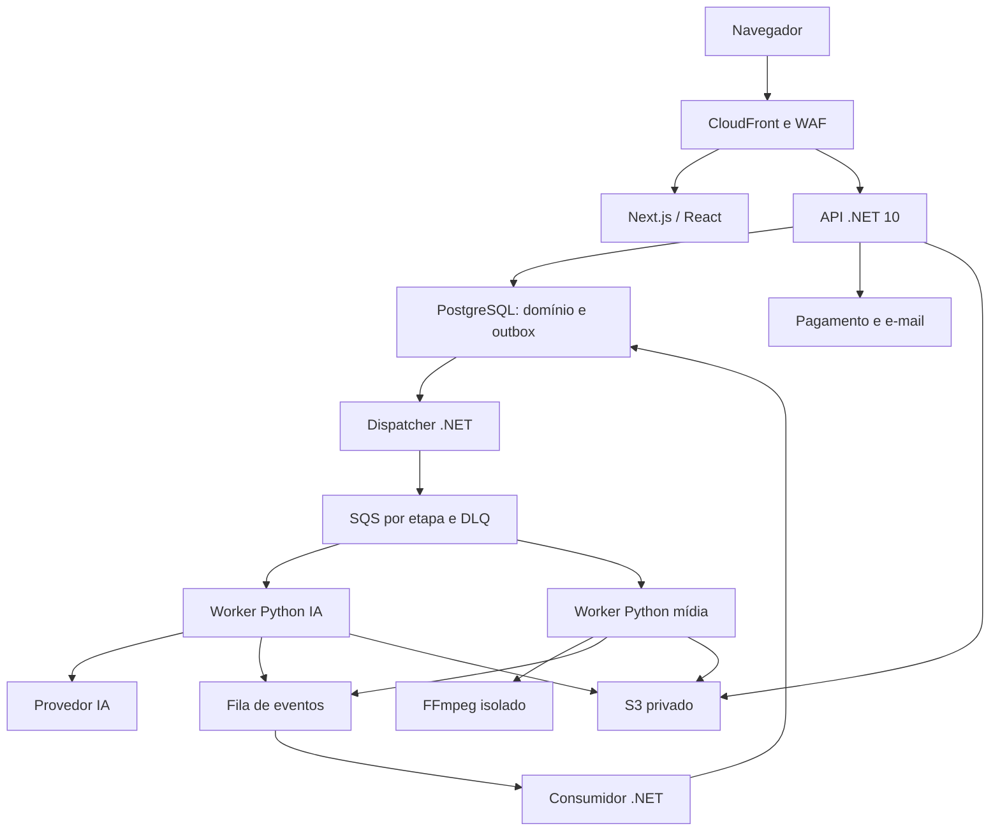
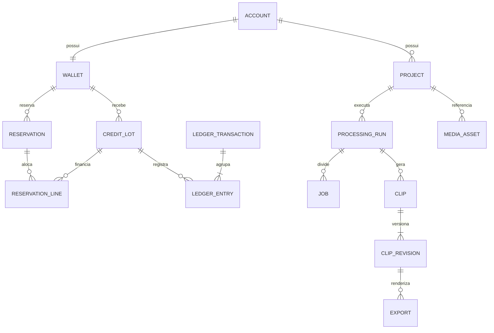

# Cortes IA — plano técnico de implementação

**Versão:** 0.1, 16/09/2026. **Estado:** proposta técnica completa para iniciar engenharia; regras pendentes explicitadas abaixo.

## 1. Base documental e preservação de escopo

R = especificação funcional v2; S = segurança v1; H = direção visual da Home. As referências usam seção e, quando útil, página do PDF. “Requisito” vem dos anexos ou da stack determinada pelo usuário; “proposta técnica” define como implementar; “sugestão de produto” depende de decisão e não amplia automaticamente o MVP.

Stack mantida: Next.js/React/TypeScript, ASP.NET Core .NET 10/EF Core, Python para IA e vídeo, FFmpeg/ffprobe, PostgreSQL, object storage, filas/workers, REST/OpenAPI e GitHub. R22 detalha AWS: RDS, S3, SQS, ECS/Fargate, ECS EC2 ou Batch para vídeo, ElastiCache, SES, CloudFront/WAF, ECR, Secrets Manager/KMS, CloudWatch/OpenTelemetry e Terraform. Este plano mantém essa arquitetura de referência e usa interfaces para evitar acoplamento comercial aos provedores. Não substitui AWS sem decisão posterior.

Todos os RF01–RF47, RN01–RN25, RNF01–RNF14 e UC01–UC25 continuam no escopo definido pelas fontes. CA01–CA20 são critérios mínimos; não autorizam remover Pix ou cartão, outros formatos, lote ZIP, extras, administração, suporte, analytics ou Home. A matriz separa MUST/SHOULD de segurança e requisitos opcionais. Pós-MVP de R21 continua pós-MVP: dublagem, B-roll, postagem direta, equipes, API pública, Drive/Dropbox, apps nativos, agendamento, desempenho social e tendências.

## 2. Conflitos, lacunas e decisões

Nenhuma linha desta tabela altera o PDF automaticamente. As resoluções técnicas indicadas podem orientar o código; decisões comerciais precisam ser registradas antes de liberar o fluxo correspondente.

| ID | Evidência e problema | Resolução proposta / decisão necessária | Gate |
|---|---|---|---|
| D01 | R RN14/R17: apagar original 24–48h após conclusão; RF19/R26 e R15: editar, reabrir e buscar outros sem reenviar | Definir “conclusão” e janela de edição. Proposta: manter fonte até finalizar renders e janela de 48h, comunicando expiração; manter masters sem legenda dos cortes para edições locais. Isso não permite escolher qualquer trecho novo depois. Alternativa: manter fonte editável por mais tempo, alterando expressamente retenção/custo. Não apagar a fonte antes de resolver. | E00/E08/E12 |
| D02 | R13/R25: extras +2/+3 e pacote Premium +6; não diz por vídeo, corte ou destino | Proposta comercial: cobrar por execução do projeto, efeitos habilitados para todos os cortes da execução, com limites explícitos. Validar unidade, quantidade personalizada e número de renders. Schema guarda unidade e versão; catálogo fica rascunho até aprovação. | E03 |
| D03 | R RN04: “até 30”, “31 a 90”; duração fracionária fica sem faixa | Proposta: 0 < duração_ms ≤ 1.800.000: 10; 1.800.000 < duração_ms ≤ 5.400.000: 30. Acima disso: faixa proposta até 10.800.000 por 60; não ativar sem aprovação. Sem arredondamento no navegador. | E00/E03 |
| D04 | R2/RF06/RF22 exigem Pix e cartão e todos os formatos; CA02 exige um meio e CA11 só 9:16 | Preservar escopo maior: ambos os meios e todos os presets no gate de MVP; critérios mínimos viram testes adicionais, não substitutos. | E04/E09 |
| D05 | R RN25/R24: grátis Terra; R24.2 manda Sol revisar candidatos | Proposta: a modalidade escolhe modelo para geração e revisão; teste usa Terra nas duas, pago Sol nas duas; Luna somente auxiliares. Confirmar intenção e medir qualidade. | E07 |
| D06 | R13: 10 gratuitos por CPF, bônus de compra; não define mistura e modelo quando saldo é misto | Separar trial, purchased, purchase_bonus e promotion. Proposta: execução grátis explicitamente escolhida usa trial/Terra; execução paga usa purchased/purchase_bonus/Sol; promoção genérica tem política própria. Não deixar ordem de consumo escolher modelo silenciosamente. | E03/E07 |
| D07 | R RN03 e R13.3: validade de bônus/promo não especificada | Pagos nunca expiram. Validade trial/promo/bônus exige política visível. Proposta: bônus de compra sem expiração até decisão, nunca usar vencimento implícito. | E03 |
| D08 | R RN07 e R25: falha interna estorna; não diz quando consumir nem falha parcial/cancelamento | Proposta de reserva e captura descrita na seção 7; estorno integral de erro interno terminal na execução principal, uma única vez; falhas parciais e chargeback dependem de política explícita. Não cobrar retry. | E03/E09 |
| D09 | R RN17/RF18/R25: edição leve grátis versus novo processamento pesado | Definir envelope editável, buscar outros, troca de efeito e destinos extras. Proposta: reaproveitar candidatos/transcrição sem análise total; novas operações pagas somente com nova cotação e confirmação. Nunca ativar extra silenciosamente. | E08 |
| D10 | S3.1 diz frontend não acessa storage; S6.1 exige upload direto pré-assinado | Interpretar proibição como acesso com credenciais/permissão ampla. Browser faz PUT/POST de um objeto em quarentena e GET autorizado por URL curta. API emite capacidade limitada após autenticação; não entrega chaves. | E05 |
| D11 | Diagrama R22 contém JWT/refresh; S4 exige cookie HttpOnly e revogação server-side | Sessão opaca com cookie seguro e estado no servidor para navegador; sem JWT persistente em localStorage. Identidade de serviço separada. | E02 |
| D12 | R RN11 “podem ser excluídos”; S SEC-STO-003 exige remover em 120 dias | Implementar obrigação do baseline de segurança, com avisos 105/115/119. Precisar horário, atividade qualificável, corrida entre login e limpeza e falha de e-mail. | E12 |
| D13 | S resumo diz criptografia + HMAC; S5.1/R19 condicionam CPF recuperável à necessidade | HMAC obrigatório; ciphertext somente se necessidade documentada. Máscara via últimos 2 dígitos. HMAC é dado pseudonimizado; retenção após exclusão para impedir novo trial requer definição jurídica, não anonimização presumida. | E02/E12 |
| D14 | R RF02: verificar telefone “quando aplicável”; S4: validar telefone | Validar formato sempre; confirmar se exige prova de posse/SMS, em quais riscos e com qual provedor. Fluxo de challenge previsto, ativação depende da política. Não presumir SMS gratuito/disponível. | E02 |
| D15 | R14: formatos sugeridos, tamanho configurável; sem limites operacionais | Definir bytes, duração máxima, codecs, resolução/FPS, cortes personalizados, renders, concorrência, timeouts, armazenamento, custo por job. Proposta inicial medida em staging, não promessa comercial. | E05/E13 |
| D16 | R9/R14: links suportados sem lista contratual | Não existe “qualquer URL”. Habilitar adaptadores por domínio após viabilidade, autorização, teste e tratamento de restrição. YouTube é candidato citado, não garantia de ingestão universal. | E06 |
| D17 | R13/R24/R26: preços e taxas de referência; pacotes e 60 créditos são propostas | Preservar valores em catálogo draft; ativar somente após benchmark de custo p95, conferência do contrato do gateway e margem aprovada. | E03/E13 |
| D18 | R16: reenquadrar rosto; RF41 cobra rastreamento inteligente | Proposta: base inclui crop/pad estático e ajuste manual; rastreamento temporal dinâmico é extra. Não prometer rastreamento grátis implicitamente. | E08 |
| D19 | R RN15: poucos trechos; CA07: ao menos uma prévia com conteúdo válido | Não inventar cortes. Resultado pode ser “sem trechos adequados”, distinto de pane técnica; definir crédito nesse caso. Proposta de produto: liberar integralmente reserva se zero candidatos úteis. | E07/E03 |
| D20 | R RF21: capas no MVP; RN23/R13: capa automática +2 | Disponibilidade do recurso não significa gratuidade. Ajustar capa já gerada é grátis; confirmar se extra inclui frame, composição IA e quantas variações. Não adicionar gerador de imagens irrestrito. | E08 |
| D21 | S14 pede SBOM; SEC-DEV-003 SHOULD e S20 lista pós-lançamento | Proposta técnica: gerar SBOM já no pipeline por baixo custo; assinatura de imagens conforme política. Não tratar SHOULD como MUST original. | E01 |
| D22 | R histórico pode reabrir; sem prazo para logs, backups, tickets, transcrições e registros financeiros | Tabela de retenção por classe e base legal precisa de responsáveis; apagar transcript/áudio junto do conteúdo, tratar backups por janela documentada e reaplicar tombstones em restore. | E12/E13 |
| D23 | R11 ledger imutável, S9 exclusão e direitos do titular | Não fazer cascade de usuário para ledger/auditoria. Desvincular/pseudonimizar quando permitido; retenção financeira e HMAC antiabuso dependem de revisão jurídica. | E03/E12 |
| D24 | H promete cortes “para viralizar”; R15 proíbe chance enganosa | Texto aspiracional sem garantia, sem percentuais de viralização. Conteúdo demonstrativo licenciado, nenhum vídeo privado usado como exemplo. | E11 |
| D25 | S SEC-DATA-004 proíbe CPF/dados de pagamento para IA, mas vídeos podem conter esses dados na própria fala | Cadastro/financeiro nunca são enviados. Conteúdo incidental exige delimitar a política: redigir transcrição antes da seleção; transcrição em nuvem recebe áudio antes de ser possível essa redação. Se a proibição for absoluta, usar transcrição local ou tratamento local prévio e avaliar custo/qualidade. Não prometer detecção perfeita. | E07/E13 |

Lacunas operacionais adicionais: região AWS/residência dos dados; metas de RPO/RTO; tempos p95 e concorrência esperada; SLA de suporte; budget de IA; emissões/documentos fiscais; política de arrependimento/estorno monetário; moderação de conteúdo e atendimento a denúncias; inventário de suboperadores e termos. São decisões, não novas funcionalidades aprovadas. Rascunhos jurídicos de R27 precisam de revisão humana competente antes da publicação; este pacote não afirma conformidade legal.

## 3. Arquitetura completa

### 3.1 Componentes e limites

Proposta técnica: monólito modular .NET para consistência do domínio, com deploys separados da API, dispatcher/consumidor e scheduler; Python separado em agente IA e worker de mídia. Evitar dividir carteira/pagamentos/projetos em bancos independentes no MVP. PostgreSQL é a fonte de verdade, Redis é cache/limitação e não garante dinheiro/idempotência.

Browser transfere bytes ao storage apenas com autorização temporária emitida pela API (seta omitida para manter diagrama legível). Agente não acessa tabelas de créditos. FFmpeg não tem credenciais de banco, nuvem, IA ou pagamento.

| Componente | Responsabilidade | Não deve fazer |
|---|---|---|
| Next.js | Home indexável, área autenticada, UI de upload/revisão/editor/checkout/admin, acessibilidade | Calcular preço autoritativo, confiar em ownerId do browser, guardar segredos em bundle |
| API .NET | Identity, CPF, sessões, autorização, cotação, ledger, pagamentos, projetos, tickets, configuração | Executar FFmpeg no request ou delegar saldo ao agente |
| Process manager .NET | Estados, dependências de jobs, retries, lease/fencing, inbox/outbox, eventos e compensações | Depender de transação distribuída com SQS/S3 |
| Agente Python | Transcrever via provider, gerar candidatos, revisar/rankear, títulos e justificativas, validação Pydantic | Escolher preço, creditar carteira, shell arbitrário ou obedecer instruções do vídeo |
| Worker de mídia | Ingestão, ffprobe, extração de áudio, preview, efeitos, render, capas, ZIP | Receber upload público ou aceitar filtros/comandos arbitrários |
| Importador | Adaptadores allowlisted e egress restrito; valida fonte e redirects | Fetch genérico, contornar bloqueios, usar cookies do servidor |
| S3 | Quarentena, temporários, artefatos aprovados e manifestos | Objetos públicos ou URLs permanentes |
| RDS | Metadados, ledger, leases, inbox/outbox, auditoria, políticas versionadas | Arquivos de vídeo, áudio ou anexos binários |
| Redis | Rate limit distribuído, cache, sinalização efêmera | Fonte de verdade de saldo e lock único de cobrança |

### 3.2 Rede, identidade e implantação

- CloudFront/WAF roteia `/` para Next e `/api/v1` para API sob mesma origem, reduzindo complexidade de cookie/CSRF. Rotas autenticadas sem cache público; vídeos privados fora do cache compartilhado irrestrito.
- API, consumidores e workers em sub-redes privadas. Load balancer recebe tráfego de aplicação; endpoints internos têm rede restrita e autenticação workload (IAM/SigV4 no ingresso apropriado ou mTLS). Não confiar só no fato de a rede ser privada.
- RDS privado com TLS, backups criptografados, PITR e teste de restore. Migrações rodam como job único com role DDL distinta da runtime. Escolher versão PostgreSQL suportada na região e fixar patch após homologação.
- Workers usam IAM por fila/prefixo; importador tem saída diferente do render. Provedor IA só é acessível pelo worker de IA. FFmpeg roda sem rede; wrapper transfere arquivo antes/depois em sandboxes diferentes.
- Fargate para API/agente quando capacidade permitir; render CPU em ECS EC2/Auto Scaling ou Batch, mantendo uma escolha operacional por ambiente. Proposta MVP: ECS EC2 para render com autoscaling por idade da fila e slots; GPU somente se benchmark justificar.
- Terraform por ambiente; dev/staging/prod com contas/credenciais isoladas; GitHub Actions via OIDC; imagens em ECR por digest, sem latest em produção. Sem segredos no Git, no prompt ou no log.
- OpenTelemetry correlaciona request → outbox → job → tentativa → provider/render → evento → ledger. Logs de auditoria separados e protegidos contra alteração pelos operadores comuns.

### 3.3 Módulos .NET

Identity & Access; Accounts & Consent; Catalog & Quotes; Wallet; Payments; Projects & Media; Processing; Clips & Editing; Export; Support; Administration; Retention; Notifications; Audit & Telemetry. Acesso entre módulos via serviços internos; somente Wallet escreve ledger; somente Processing decide estados de execução. Controllers traduzem DTOs, sem lógica financeira. Eventos de domínio viram outbox dentro da transação. Não há API pública para terceiros no MVP, mesmo usando REST documentada internamente.

## 4. Estrutura dos repositórios

Proposta: cinco repositórios privados. Escala de times não foi informada; essa divisão segue runtimes e privilégios, sem criar um repositório por módulo. Alternativa monorepo é possível, mas não é a decisão adotada aqui.

| Repositório | Pastas principais | Build/entrega |
|---|---|---|
| `cortes-ia-web` | `src/app/(marketing)`, `(auth)`, `(platform)`, `(admin)`; `features/`; `components/`; `lib/api-generated/`; `tests/`; `public/` | Next.js, TypeScript, lint, testes UI/E2E, Dockerfile |
| `cortes-ia-api` | `src/Api`, `Application`, `Domain`, `Infrastructure`, `ProcessingHost`, `SchedulerHost`; `tests/Unit`, `Integration`, `Architecture`; `migrations/` | .NET 10, EF Core, xUnit/Testcontainers, OpenAPI gerado |
| `cortes-ia-workers` | `packages/contracts`, `agent/providers`, `agent/prompts`, `agent/pipeline`, `media/ingest`, `media/render`, `media/export`; `tests/fixtures`, `evals/`; `images/` | Python 3.12 de R22, lockfile, Pydantic, pytest; imagens AI/media distintas |
| `cortes-ia-contracts` | `openapi/`, `events/`, `schemas/`, `examples/`, `compatibility-tests/`, `changelog/` | Artefatos versionados e SDK TypeScript/Python; revisão cruzada |
| `cortes-ia-infra` | `modules/`, `environments/local,dev,staging,prod`, `observability/`, `runbooks/`, `policies/`, `docs/adr/` | Terraform, Compose local, políticas IAM, dashboards/alertas |

As pastas acima são a estrutura definida, não repositórios remotos já criados. Em todos: README, ownership/CODEOWNERS, licença definida pelo titular, `.gitignore`, `.editorconfig`, `.env.example` sem valores reais, SECURITY.md, checks de PR e releases SemVer. `main` protegida, branches curtas, review obrigatório. Conventional Commits é sugestão presente em R22.

Contrato é desenhado neste pacote; na implementação, OpenAPI gerado pela API é comparado com baseline aprovado em `contracts`, evitando duas fontes divergentes. Breaking changes exigem versão principal/rota nova; eventos recebem schemaVersion imutável e compatibilidade N/N−1 por janela definida. Publicar SDK com versão fixa; nada de copiar DTO manualmente entre projetos.

Local: PostgreSQL, Redis, emulador S3/SQS (LocalStack quando útil), fake gateway, fake provider e captura de e-mails. Testes reais de IA são separados, acionados explicitamente e com orçamento; CI padrão não gasta IA nem cobra cartão.

## 5. Modelo de banco

### 5.1 Convenções e agregados

DDL de referência em `database/modelo.sql`. UUIDs não sequenciais, timestamps `timestamptz` em UTC, duração em milissegundos inteiros, créditos `bigint` inteiros, dinheiro em centavos e moeda ISO, custos técnicos `numeric` com moeda explícita. API serializa inteiros monetários/créditos conforme schema; nunca usa float para cobrança. Migrations EF Core são autoridade na implementação. Esquema Identity oficial deve ser gerado pelo framework, sem reimplementar senha/MFA manualmente.

| Grupo | Entidades e relações | Invariantes |
|---|---|---|
| Conta | account 1:1 Identity; sessões; CPF fingerprints; trial_claim; consents | E-mail normalizado único; CPF HMAC por versão de chave; trial único por identidade CPF; tokens só hash |
| Catálogo | catalog_version → duration_tier, feature_price, style_combo, credit_package, platform_preset; ai_policy | Versões publicadas imutáveis; pacote guarda base/bônus/centavos; modelo e prompt pinados |
| Projetos | account 1:N project → upload_session, media_asset, transcript, processing_run | Objetos externos privados; ownership por FK composta; duration validada pelo servidor |
| Execução | run → job → attempt; job_dependency; outbox/inbox | run vinculado à quote e reserva; tentativa usa lease/fencing; mesma logical key não duplica job |
| Cortes | run → clip → clip_revision → subtitle_track, cover, export | Timestamps dentro do vídeo; revisões imutáveis; export fixa revisão e preset |
| Carteira | account → wallet → credit_lot; reservation → reservation_line; ledger_transaction → ledger_entry | Comprados sem validade; ledger append-only; reservas e saldo serializados; origem preservada |
| Pagamentos | account → purchase → payment_event/refund | Snapshot do pacote, gateway id único; evento único; saldo só após conciliação confiável |
| Suporte | ticket → message → attachment; access_grant | Vínculo projeto/corte do mesmo titular; anexos em quarentena; acesso excepcional expira/audita |
| Operação | audit_event, notification, retention_task, deletion_request, provider_usage | Logs sem payload sensível; notificações por ciclo; exclusão idempotente e rastreável |

### 5.2 ER principal

### 5.3 Consistência, índices e dados sensíveis

Índices: project `(account_id, created_at DESC, id)`; job `(status, next_attempt_at)`; outbox `(published_at, available_at)`; media `(deletion_state, expires_at)`; notification dedupe; purchase `(provider, provider_payment_id)`; CPF `(key_version, digest)`; idempotência `(account_id, operation, key_hash)`; ledger `(wallet_id, created_at, id)`; retention por `(account_id, activity_epoch, milestone)`.

`account_id` é derivado da sessão, não aceito como ownerId mutável. FKs compostas amarram projeto/asset/corte à conta onde aplicável; relações adicionais são verificadas pelo domínio. SQL CHECK não pode validar soma entre linhas nem todos os timestamps contra duração de outra tabela: usar transações, constraints deferrable/triggers pertinentes e testes de domínio. A DDL não afirma resolver toda regra sozinha.

Conteúdo completo de transcrição e legendas versionadas pode ficar como JSON/SRT/ASS privado no storage; banco mantém referências, idioma, quantidade de segmentos e hash. Textos editáveis curtos/metadados podem estar em JSONB validado por schema. JSONB não substitui FKs/status financeiros. Arquivos brutos de webhooks não ficam em logs; persistir apenas campos normalizados necessários ou payload reduzido/criptografado conforme retenção.

CPF: normalizar dígitos, validar dígitos verificadores (não prova identidade), HMAC-SHA256 com chave distinta da criptografia, últimos 2 dígitos para máscara. Rotação deve comparar fingerprints nas versões ativas ou migrar em ambiente controlado; não conceder novo benefício por mudança de chave. Se não houver CPF recuperável, rekey requer estratégia de transição/novo fornecimento; não apagar índice antigo sem plano. `trial_claim` é consumido atomicamente junto do grant de 10 créditos, impedindo corrida de cadastros. Decidir se CPF pode identificar várias contas ou só uma; requisito garante benefício único, não necessariamente proíbe contas múltiplas.

Excluir projeto não apaga ledger. Exclusão da conta abre workflow com reautenticação e política de retenção; não executar cascade em compras/auditoria. Chaves de mídia usam UUID, nunca CPF, e-mail ou nome original.

## 6. APIs e contratos

### 6.1 Convenções transversais

Contrato proposto em `contracts/openapi.json`, prefixo `/api/v1`; endpoints internos em `/internal/v1`, fora de exposição pública. Swagger/OpenAPI disponível em local/staging e restrito em produção. Cookies Secure/HttpOnly/SameSite, sessões revogáveis, CSRF em mutações autenticadas; login também valida origem e proteção antiforgery apropriada. Não guardar bearer duradouro em localStorage. WAF não substitui autorização por recurso.

POST financeiro/processamento exige `Idempotency-Key`; armazenar hash do payload canônico, identidade, operação e resposta. Mesma chave/mesmo body devolve resposta anterior; mesma chave/body diferente → 409. Dedupe financeiro por chaves de negócio permanece mesmo após TTL do cache HTTP. PATCH de configuração/revisão exige `If-Match`; versão velha → 412. Sem propriedade sensível extra silenciosamente aceita.

HTTP: 201 criado, 202 tarefa aceita com job/status URL, 200 leitura, 204 operação sem body; 400 validação sintática, 401 sessão ausente, 403 papel/CSRF, 404 inexistente ou não pertencente, 409 conflito/saldo/cotação, 410 mídia expirada, 413 grande, 415 formato, 422 restrição semântica, 429 limite (Retry-After), 503 serviço indisponível. Problem Details contém type/title/status/code/traceId/errors sanitizados, nunca stack. Listas usam cursor opaco, limite máximo, ordenação estável e escopo do usuário. Paginação de ledger não muda saldo.

### 6.2 Recursos cobertos

| Grupo | Rotas principais | Regra |
|---|---|---|
| Auth | register, email verification, phone challenge, login, MFA challenge, logout, password reset, reauthenticate | Respostas não enumeram CPF/e-mail; MFA obrigatório admin; reset invalida sessões |
| Conta | GET/PATCH me, dashboard, consent, deletion-request | Alterar e-mail/telefone/excluir exige autenticação recente |
| Catálogo | GET catalog, presets, packages | Versões ativas, faixas e capacidades; catálogo draft só admin |
| Carteira | GET wallet, wallet/transactions | Saldo disponível, reservado, comprado, bônus, promo e vencimentos |
| Pagamento | POST purchases, GET purchases/id, webhook | Cliente envia packageId/method, não créditos/preço; provedor confirma valor/BRL/recebedor |
| Ingestão | POST projects/uploads, complete/abort; POST projects/imports | Cria histórico ao aceitar; bytes só em quarentena; importação segura |
| Projeto | GET projects/id, PATCH configuration, POST quotes, POST runs, GET status | Config versão; cotação validada; geração só após confirmação |
| Revisão | GET clips, PATCH selection, POST alternatives, POST revisions | Rejeições persistidas; revisão sem destruir original; preço novo só se regra aprovada exigir |
| Legendas/capas | GET/PUT revision subtitles; POST covers | Timestamps e estilos allowlisted; permissão de efeito contratada |
| Export | POST exports, GET exports/id, POST bundles, GET media/id/download | Só selecionados; múltiplos destinos; ZIP assíncrono; URL curta após ownership |
| Suporte | tickets, messages, attachment-upload | Categoria/status/vínculo válidos; anexos privados validados |
| Admin | users/block, credit-adjustments, refunds, jobs/retry, tickets, catalogs, ai-policies, metrics, access-grants | MFA+RBAC+step-up+motivo+auditoria; sem impersonação no MVP |
| Interno | job lease, heartbeat, manifest | Identidade de worker; nenhuma sessão de usuário; scope job/attempt/prefixo |

### 6.3 Exemplo de cotação e confirmação

`POST /projects/{id}/quotes`: body `{configurationVersion: 4, modality: "paid"}`. A API lê duração validada e config armazenada, não usa duração/preço enviados como verdade.

Resposta ilustrativa: `{id, catalogVersion: 3, projectVersion: 4, durationMs: 1500000, items:[{code:"base_30",credits:10},{code:"dynamic_captions",credits:3}], totalCredits:13, balanceAfter:37, expiresAt, termsVersion, sourceFingerprint}`. Os números ilustram as tabelas dos PDFs, não uma compra real.

`POST /projects/{id}/runs`: `{quoteId, configurationVersion:4, rightsAccepted:true, termsVersion}` e Idempotency-Key. Em uma transação: validar quote/duração/versões/conta, reservar lotes, criar run/jobs/outbox, salvar resposta idempotente. Retornar 202. Quote vencida ou arquivo/configuração alterado → 409 `QUOTE_STALE`; UI pede confirmação novamente. Não recalcular preço para cima depois de aceitar sem nova autorização.

Uploads: o navegador pode mostrar estimativa prévia conforme R7, mas duração local é não confiável. Iniciar sessão de upload não inicia IA nem consome. Após ffprobe isolado, publicar cotação verificada; se estimativa anterior coincidir, confirmar explicitamente no fluxo; se divergir, exibir correção antes de processar. Essa etapa resolve a impossibilidade de validar integralmente arquivo não recebido. Orçamento da verificação de segurança fica limitado por quotas, não cobra processamento escondido.

Status UI via polling com ETag/backoff (proposta inicial); SSE é alternativa técnica, não requisito de produto novo. Resposta contém etapa, contadores concluídos/total quando conhecidos, lastUpdatedAt, retryAt, código público de erro e ações permitidas. Não inventar porcentagem exata de IA.

## 7. Créditos, transações e pagamentos

### 7.1 Catálogo inicial preservado

| Item | Valor documental | Status |
|---|---:|---|
| Base até 30 min com legenda simples/vertical | 10 créditos | Requisito R RN04/RN21 |
| Base 31–90 min | 30 créditos | Requisito; resolver fronteiras D03 |
| Base 91–180 min | 60 créditos | Proposta de R13, não ativada automaticamente |
| Trial por CPF | 10 créditos, uma vez | Requisito; validade pendente |
| Legenda dinâmica / zoom / blur / enquadramento / capa | +3 / +2 / +3 / +2 / +2 | Valores iniciais configuráveis R13; unidade D02 |
| Premium completo | +6 | Configurar membros e evitar dupla cobrança |
| Básico / Social / Viral / Podcast / Premium | +0 / +5 / +7 / +6 / +6 ou promocional | Composição sugerida R25 |

| Pacote | Comprados | Bônus | Total | Preço sugerido |
|---|---:|---:|---:|---:|
| Start | 50 | 0 | 50 | R$ 19,90 |
| Creator | 150 | 20 | 170 | R$ 49,90 |
| Pro | 400 | 80 | 480 | R$ 99,90 |
| Studio | 1.000 | 300 | 1.300 | R$ 199,90 |
| Agência | 2.500 | 1.000 | 3.500 | R$ 399,90 |

Pacotes são hipóteses comerciais do PDF. Catálogo tem `draft/published/retired`, vigência, versão, autor e aprovação. Combos são conjuntos de entitlements; normalizar features em conjunto e aplicar desconto de combo explícito, sem somar duas vezes efeito coberto. Cotação guarda snapshot completo, não apenas total. Dinâmica substitui apresentação simples, que já está incluída; não cobrar “legenda simples” novamente.

### 7.2 Ledger e reserva

Proposta: ledger de créditos append-only por lote e transação, com deltas `available_delta` e `reserved_delta`. Carteira e lote possuem projeções de saldo atualizadas na mesma transação; reconciliação recalcula pelo ledger. Não é contabilidade monetária fiscal: compras em BRL ficam separadas de créditos de uso.

| Operação | Disponível | Reservado | Condição |
|---|---:|---:|---|
| Compra/bônus/trial | +N | 0 | Confirmação confiável ou elegibilidade única |
| Reserva | −N | +N | Cotação confirmada e saldo suficiente |
| Captura | 0 | −N | Entrega do marco contratado |
| Liberação | +N | −N | Cancelamento elegível/falha antes da captura |
| Estorno de captura | +N | 0 | Falha interna terminal; referencia consumo |
| Expiração promo | −N | 0 | Apenas saldo disponível de lote vencido |
| Ajuste admin | ±N | 0 | Papel, motivo, limite e step-up |

Saldo utilizável = soma dos lotes elegíveis disponíveis não vencidos, nunca negativo. Créditos pagos não vencem; limpeza de mídia não toca carteira. Promoção vencendo durante reserva mantém a reserva até terminar; liberar após vencimento repõe no lote original e lança expiração em seguida. **Proposta a validar:** falha interna que prejudique trial/promo deve estender validade compensatória ou emitir lote substituto de mesma natureza, sem converter indevidamente em comprado.

Algoritmo transacional: travar wallet `SELECT FOR UPDATE`; localizar/cadastrar registro de idempotência; selecionar lotes elegíveis por expiração mais próxima, depois criação/id, sempre na mesma ordem; validar saldo; gravar reservation e allocations; ledger RESERVE; atualizar projeções; criar run/job/outbox; commit. Lock Redis não protege esse processo. Transação com erro faz rollback completo; retry serializado usa a mesma chave de operação. Grant/refund usa lock idêntico.

**Marco proposto de captura:** prévias utilizáveis entregues (`AGUARDANDO_REVISAO`), pois usuário pode abandonar sem exportar. Renders finais previstos ficam como obrigação incluída. Falha técnica final nos renders contratados, após retries, estorna a cobrança original uma vez; se uma parte foi entregue, política de compensação precisa ser definida (D08). Até isso, proposta conservadora de estorno integral, sem cobrança silenciosa por artefato entregue. Zero bons candidatos usa regra D19; rejeição subjetiva com candidatos válidos não é automaticamente erro interno.

Estornos cumulativos não podem exceder captura original. `reverses_transaction_id`+chave de operação identifica compensação; a aplicação verifica saldo de reversão sob lock. Não editar linha do ledger; corrigir com lançamento inverso. Audit e ledger não aceitam DELETE/UPDATE pela role runtime. Outbox e reserva garantem que não exista cobrança sem execução recuperável, mesmo se SQS cair.

### 7.3 Pagamentos

Mercado Pago recomendado em R26; usar checkout/SDK tokenizado para Pix e cartão, sem PAN/CVV no backend, banco ou log. Pedido salva pacote/preço/bônus/moeda imutáveis, usuário, id externo, expiração Pix e chave idempotente do gateway. Estado: `PENDING → APPROVED | REJECTED | CANCELLED | EXPIRED`; após aprovado: `PARTIALLY_REFUNDED | REFUNDED | CHARGEBACK`. Eventos fora de ordem exigem consultar estado autoritativo antes de transicionar; não voltar de REFUNDED para APPROVED por webhook antigo.

Webhook: validar assinatura conforme documentação corrente e secret correto, limite de corpo e replay; persistir evento deduplicado; reconciliar server-to-server paymentId, merchant/recebedor, externalReference, moeda, valor e status; em transação creditar uma única vez dois lotes (comprado e bônus) e notification outbox. Mesmo pagamento em diferentes eventIds não duplica grant: chave de negócio `purchase:{id}:grant` única. Responder ao provedor após persistência durável; falha de conciliação fica pendente para worker, sem liberar saldo.

Estorno monetário ≠ estorno por falha de processamento. O primeiro devolve BRL e remove os créditos correspondentes, o segundo devolve créditos consumidos. Para reembolso/chargeback de créditos já usados, não fabricar saldo disponível negativo: criar débito financeiro/risco em entidade própria, bloquear consumo conforme política aprovada e enviar revisão. Bônus vinculado acompanha reversão proporcional segundo política. Gateway é chamado via saga/outbox idempotente, nunca dentro de lock longo de banco. Reconciliação periódica detecta pagamento aprovado sem grant, grant divergente, webhook perdido e reembolso incompleto.

## 8. Comunicação .NET → fila → Python → FFmpeg

### 8.1 Contrato assíncrono

JSON Schemas fornecidos no pacote. Filas por etapa: `ingest.validate.v1`, `link.import.v1`, `audio.extract.v1`, `ai.transcribe.v1`, `ai.select.v1`, `ai.review.v1`, `media.preview.v1`, `media.render.v1`, `media.cover.v1`, `media.bundle.v1` e `processing.events.v1`; cada uma com DLQ e política de retenção. Notificações/retenção podem usar filas próprias .NET. Nomes finais levam ambiente/prefixo.

Mensagem contém `schemaVersion`, `messageId`, `jobId`, `runId`, `projectId`, `correlationId`, `stage`, `inputManifestId`, `expectedProjectGeneration`, `policyVersion`, `createdAt`, `deadlineAt`. Referências opacas, sem CPF, URL assinada, vídeo, transcrição ou segredo. Manifesto privado versionado contém entradas autorizadas, checksums, configurações, revisão, durationMs, outputs permitidos e budgets. Worker recebe permissão curta após lease, não toma a mensagem como autorização para ler objeto arbitrário.

Evento contém `eventId`, `jobId`, `attemptId`, `leaseToken` (fencing inteiro, não credencial), `sequence`, `kind`, `stage`, timestamps, outputManifestId ou código de erro/retryable, contadores e métricas sanitizadas. `succeeded`, `failed`, `progress` e `heartbeat` têm validação estrita; sucesso sem manifesto é inválido. O agente pode ser executado standalone com fixture de transcrição (CA18), sem depender de endpoint .NET para avaliar provider.

### 8.2 Execução e recuperação

1. .NET confirma cotação/reserva/run/jobs e outbox na mesma transação. Dispatcher publica no SQS e marca publicado; crash entre publicar e marcar pode duplicar, portanto consumidor é idempotente.
2. Worker recebe comando e pede lease no endpoint interno. .NET compara status/generation/dependências, incrementa fencing token e registra attempt. Outro worker não ganha lease ativo. Job terminado retorna no-op; job deletado/cancelado não executa.
3. Worker obtém manifesto e artefatos estritamente autorizados; verifica tamanho/hash e quotas. Wrapper prepara filesystem efêmero. FFmpeg/ffprobe executa como processo isolado sem root, sem rede, com args array, filtros construídos por código allowlisted, CPU/RAM/disco/pids/timeout e encerramento de todo process group.
4. Transcrição vai a provider configurado; selecionar e revisar são duas etapas independentes. Saídas estruturadas validam intervalos, duração, idioma e duplicação. Prompt injection no conteúdo nunca concede ferramenta, filesystem ou shell.
5. Artefatos são gravados em prefixo de tentativa imutável. Worker publica evento somente depois de todos os outputs e manifesto persistidos com checksum. Publicação confirmada precede ACK/DeleteMessage do comando. Se evento não publicar, não ACK; retry recupera manifestos sem recobrar usuário.
6. Consumidor .NET faz inbox dedupe por eventId e invariantes por job/attempt/fencing. Ignora evento atrasado de tentativa antiga, edição nova ou exclusão. Valida referências/objetos esperados; transaciona conclusão, próximos jobs/outbox e eventual captura/liberação. Só depois ACK do evento.
7. Heartbeat renova lease no banco e visibility no SQS. Perda de lease faz worker interromper; resultado tardio fica órfão para limpeza. Expiração de visibility isolada pode gerar duplicata, mas fencing impede publicar resultado válido duas vezes.
8. Watchdog identifica lease expirado e job preso, agenda nova tentativa com backoff/jitter e orçamento. Falha terminal vai para DLQ/triagem, atualiza projeto e compensa automaticamente. Reprocessar na administração reutiliza entitlement/charge original e exige motivo; nunca criar novo débito por retry técnico.

Proposta operacional inicial, a medir: visibility 120 s, heartbeat 30 s; máximo 3 tentativas para falhas transitórias de rede/429/5xx, respeitando Retry-After e deadline total; limites próprios por etapa. Erro de schema, mídia inválida ou link restrito não entra em loop. SQS é at-least-once; não prometer exactly-once de computação. O efeito financeiro é único por transação/chave. Jobs devem ser particionados para ficar abaixo do limite de visibility do SQS; não segurar mensagem por render ilimitado.

A AWS documenta possibilidade de entrega repetida e recomenda consumidores idempotentes ([SQS delivery](https://docs.aws.amazon.com/AWSSimpleQueueService/latest/SQSDeveloperGuide/standard-queues-at-least-once-delivery.html)). O limite de visibility é 12 horas a partir do recebimento; heartbeat não reinicia esse máximo ([SQS processing](https://docs.aws.amazon.com/AWSSimpleQueueService/latest/SQSDeveloperGuide/best-practices-processing-messages-timely-manner.html)).

### 8.3 Pipeline multimídia

Ingestão/quarentena → validação container/codec/tamanho/duração → áudio normalizado → transcrição timestamped → sinais de pausa/locutor/cena/energia quando possível → candidatos → revisão/ranking → prévias reduzidas com efeitos contratados → revisão humana → render apenas dos selecionados → manifestos finais/ZIP. OpenCV/MediaPipe/PySceneDetect são ferramentas de R22 quando necessárias, não chamadas obrigatórias em todo vídeo.

Padronizar coordenadas normalizadas, tempo em ms, resolução/fps e aspect ratio no plano de render. Reenquadramento dinâmico suaviza trajetórias e mantém safe areas; crop manual é validado. Legendas têm escapes para ASS/SRT, fontes allowlisted e texto nunca vira expressão de filtro. Dinâmica palavra a palavra só é habilitada se timestamps/alinhamento suportarem qualidade; capability check e fallback explícito antes de cobrar. Capa por frame/composição segue configuração contratada; não presumir geração de imagem com custo ilimitado.

Render final de ao menos 1080p quando fonte permitir; não anunciar qualidade obtida por upscale como detalhe real da fonte. Presets são versionados para todos os destinos de R16, com safe area/resolução/codec/fps e constraints; limites das redes devem ser revistos antes do release, não cristalizados neste plano. ZIP é assíncrono, privado, com nome sanitizado, sem path traversal e inclui somente arquivos do titular.

## 9. Estados dos vídeos e jobs

Preservar nomes de R12 como status público. Criar dimensões técnicas separadas para não confundir pagamento, mídia e processamento. `ENVIANDO` entra no histórico ao aceitar sessão/importação; não esperar análise para registrar.

| Estado público | Entrada/saída permitida | Efeito financeiro |
|---|---|---|
| ENVIANDO | Aceitação → RECEBIDO; inválido → ERRO; fonte restrita → BLOQUEADO_RESTRICAO; exclusão → EXCLUIDO | Sem captura; validação não inicia cobrança |
| RECEBIDO | Fonte validada; subestado aguarda confirmação/na fila → TRANSCRIBINDO | Reserva só após confirmação da quote |
| TRANSCRIBINDO | Áudio/transcrição → ANALISANDO; transitório aguarda retry; terminal → ERRO | Reserva mantida durante retry |
| ANALISANDO | Candidatos e revisão → GERANDO_PREVIAS; terminal → ERRO; sem bons trechos → AGUARDANDO_REVISAO com outcome específico | Zero candidatos segue D19 |
| GERANDO_PREVIAS | Prévia válida → AGUARDANDO_REVISAO; falha terminal → ERRO | Captura no marco proposto ao entregar prévias |
| AGUARDANDO_REVISAO | Seleção → RENDERIZANDO; alternativas → ANALISANDO em run/operação versionada | Edição leve sem cobrança; nova carga pesada só com regra aprovada |
| RENDERIZANDO | Todos os exports solicitados válidos → PRONTO; falha terminal → ERRO, preservando artefatos já entregues | Sem segundo débito; compensação conforme D08 |
| PRONTO | Download; edição/reexport → RENDERIZANDO; alternativas → ANALISANDO se fonte disponível | Edição leve/retry incluídos |
| ERRO | Retry elegível retorna à etapa registrada; irreparável fica com código e suporte | Liberação/estorno idempotente de falha sistêmica |
| BLOQUEADO_RESTRICAO | Fonte indisponível; usuário pode criar nova importação ou excluir | Nenhum consumo definitivo |
| ARQUIVOS_EXPIRADOS | Limpeza finalizada; histórico preservado; não reprocessar sem fonte válida | Pagos preservados |
| EXCLUIDO | Tombstone impede novos downloads/jobs; limpeza física rastreada separadamente | Política de cancelamento D08; nunca apagar ledger |

Jobs: `PENDING → QUEUED → RUNNING → SUCCEEDED`, ou `RUNNING → RETRY_WAIT → QUEUED`, ou `FAILED_FINAL/CANCELLED`. Reserva: `ACTIVE → CAPTURED | RELEASED`; compensação de CAPTURED é transação REFUND, não voltar a ACTIVE. Asset: `QUARANTINED → VALIDATED → AVAILABLE → DELETE_PENDING → DELETED`; também `REJECTED`. Run: `QUEUED/RUNNING/AWAITING_REVIEW/COMPLETED/FAILED/CANCELLED` com generation.

Status de projeto é projeção do run corrente e operações ativas, não sobrescrito indiscriminadamente por cada evento. Falha de uma exportação informa estado do item e agregação; não declarar PRONTO até todos os itens solicitados terminarem. Progresso de versão antiga não regressa projeto novo. Retry transitório expõe etapa+tentativa, sem marcar erro terminal antecipadamente.

Exclusão durante render: transação incrementa generation, marca tombstone, impede novas leases/downloads e agenda limpeza; worker interrompe quando detectar; outputs tardios são ignorados e removidos. URL já emitida só perde acesso ao expirar ou remover o objeto; comunicar prazo curto, não prometer revogação criptográfica imediata da URL. Nunca ressuscitar EXCLUIDO por evento atrasado.

## 10. Segurança e privacidade aplicadas

Baseline S: ASVS nível 2 conforme versão citada no documento; o checklist completo de segurança e rastreabilidade deve acompanhar o PR/release. Não declarar conformidade apenas por usar framework.

| Superfície | Implementação planejada | Evidência de conclusão |
|---|---|---|
| Login/admin | Identity, sessão revogável, MFA obrigatório, rate limit conta/IP, reset único, step-up | Testes enumeração, sessão fixa, logout, CSRF e acesso admin sem MFA |
| Ownership | Policies por recurso, account scope server-side, IDs UUID | Usuário A não lê/altera/baixa project/cut/ticket/payment/asset de B |
| CPF | HMAC com chave separada, ciphertext opcional KMS, máscara, redaction | Dump/payload/log sem CPF legível; concorrência trial único |
| Upload | Quarentena, magic bytes/ffprobe isolado, scan quando aplicável, limites em multipart e pós-upload | MIME falso, arquivo truncado, gigante, nomes hostis e timeout controlados |
| Links | Allowlist de host exato e adaptadores; DNS/IP público IPv4/IPv6 antes de conexão, redirects revalidados | DNS rebinding, IPv4 mapeado em IPv6, metadata, loopback e redirects bloqueados |
| SSRF detalhado | Pin de IP validado na conexão, preservar TLS/SNI do host autorizado; egress bloqueia redes internas | Sem segunda resolução DNS não validada; não basta regex do hostname |
| FFmpeg | argv, sem shell, paths UUID, whitelist de filtros/codecs/fontes, sandbox não-root/no-network | Injeção não executa; parser hostil não afeta host/outros jobs |
| IA | Conteúdo separado de instrução, schemas estritos, tools allowlisted, budgets | Prompt injection, JSON inválido e timestamps fora de faixa são rejeitados |
| Pagamentos | Assinatura/replay/conciliação, sem PAN/CVV, RBAC | Webhook forjado ou divergente não credita; 100 duplicatas creditam uma vez |
| Storage | Block Public Access, criptografia, URLs curtas, TTLs por finalidade | Enumeração/URL expirada/ownership e limpeza verificados |
| Cadeia de software | SAST/SCA/secrets/container scan, lockfiles, review, OIDC, SBOM proposto | Merge/release bloqueia falha crítica segundo política formal |
| Recuperação | Backup criptografado, restore, tombstones, rotação, runbook | Ensaio de restore e incidente com responsáveis e tempos medidos |

Admin: papéis Support, Finance, Security e Superadmin, permissões por ação; Support não ganha acesso a conteúdo automaticamente. Conceder access_grant temporal e específico ao ticket/projeto com motivo, auditoria e privilégio autorizado. Ajustar créditos exige papel Finance e autenticação recente para limite sensível definido. Papéis e auditoria não são mutáveis pelo mesmo caminho de administração sem controle adicional. Não implementar impersonação no MVP (S12 recomenda evitar).

Analytics de R28 somente após consentimento aplicável, revogável e versionado. Eventos mínimos preservados: sign_up_started, sign_up_completed, free_credit_granted, upload_started, upload_completed, processing_started, preview_ready, clip_selected, export_completed, checkout_started, purchase_completed, support_opened. GA4/Meta nunca recebem CPF, transcrição, título sensível de vídeo ou URL assinada; apenas identificadores pseudonimizados e propriedades allowlisted. Telemetria essencial de segurança não depende de cookies de marketing; finalidades separadas.

## 11. Retenção, exclusão e notificações

Atividade proposta: acesso autenticado intencional à plataforma, não webhook, worker, e-mail aberto, analytics ou tarefa agendada. Atualizar `last_active_at` e `activity_epoch`; avisos têm dedupe `(account, epoch, milestone)` aos 105/115/119 dias. Scheduler usa UTC; UI exibe data local e deadline. Definir comportamento para falha de entrega e janela de tolerância (D12); não afirmar que e-mail foi entregue só porque SES aceitou.

Aos 120 dias, criar plano de exclusão por epoch; antes de cada lote de delete verificar epoch/status com transação. Login cancela tarefas ainda não executadas e reavalia conta; não recupera objeto já apagado. Operações destrutivas devem ter cutoff explícito para resolver corrida. Tombstone imediato revoga emissão de URLs; status ARQUIVOS_EXPIRADOS só após confirmação dos objetos ou inventário de ausência. Lifecycle do S3 serve de rede de segurança para temporários/objetos marcados, não pode expirar todos por idade de criação ignorando atividade do usuário.

| Classe | Política |
|---|---|
| Upload incompleto/quarentena rejeitada | TTL técnico curto configurado; abort multipart; proposta 24h a validar |
| Original validado | D01: 24–48h preferencial após conclusão técnica, sem sacrificar edição prometida silenciosamente |
| Áudio/transcript intermediário/masters | Somente necessidade técnica; prazo explícito; não usar cópia derivada para contornar exclusão do original |
| Prévias/finais/capas/legendas/ZIP | Até exclusão manual ou 120 dias sem atividade; ZIP pode ter TTL menor se regenerável |
| Histórico leve | Preservar status/datas conforme política de conta e privacidade |
| Ledger/compras/audit/tickets | Retenção própria aprovada, com minimização; nenhum prazo legal inventado |
| Backups | Janela definida, expiração documentada; restore reaplica exclusões; acesso estritamente restrito |

Notificações transacionais: confirmação de e-mail, recuperação de senha, alerta de credenciais/login anômalo, processamento com prévias prontas, compra confirmada e avisos de inatividade; suporte conforme fluxo. R27.3 chama “prontos” a entrega de prévias: email deve dizer claramente que são prévias para revisão, não exports finais. Cada notificação é idempotente e passa por outbox com tentativas/estado de entrega.

## 12. Frontend e Home preservados

Área autenticada: dashboard com saldo comprado/bônus, criações/vídeos/cortes/capas; upload com bloqueio por tela e progresso; cotação em tempo real; histórico imediato; acompanhamento; player de prévias; seleção/descartar/buscar outros; editor leve de tempos, título, legenda, estilo, crop; efeitos com entitlements; exportações múltiplas e ZIP; perfil/compra/histórico/suporte/admin.

H fica em rota pública separada de regras de upload. Hero escuro de água digital original, azul/roxo/ciano; movimento leve ao mouse; CTA principal para plataforma e secundário para como funciona; navbar e scroll. Seção de gaveta técnica/elegante com só 5–15% das pontas dos vídeos visíveis; scroll abre gaveta, eleva um cartão sozinho, inclina e destaca vídeo 9:16; os demais permanecem guardados; sem mão humana, carrossel tradicional ou miniaturas inteiras iniciais. Hover/click nas pontas é opcional em H9, não gate obrigatório.

Componentes H19: HomePage, HeroFluidBackground, Navbar, HeroContent, ScrollIndicator, VideoDrawerSection, VideoDrawer, VideoFileTip, FeaturedVideoCard, HowItWorks, Features, SupportedPlatforms, CreditsSection, FinalCTA, Footer. GSAP/Framer Motion são sugestões de biblioteca; escolher uma responsável pela sequência para evitar conflito de scroll. Three/R3F apenas se necessário, lazy loaded; LCP não depende de WebGL. Mobile simplifica água e inclinação; reduced-motion e fallback estático mantêm conteúdo/CTA. Teclado, foco, aria, contraste e textos alternativos obrigatórios. Exemplos em vídeo só carregam perto da viewport e com licença/autorização.

Home mantém diferenciais, redes, crédito sem assinatura, CTA final e footer com Termos/Privacidade/Suporte/Login. Mostrar 10 créditos com qualificador “básico até 30 minutos”, não custo universal de qualquer vídeo. SEO indexável, canonical/sitemap/robots/OG e structured data somente correspondente ao conteúdo. Nenhuma garantia numérica de viralização.

## 13. Operação, qualidade e critérios globais

Build/lint/testes aprovados; migrations testadas em staging; segurança por requisito; contratos sem quebra inesperada; observabilidade com traceId; rollback documentado; nenhum segredo no código. Mudanças de banco seguem expand/contract para permitir rollback do app sem destruir dados. Artefatos promovidos por digest entre ambientes.

Métricas: idade e profundidade das filas, latência por etapa/p95, tentativas/DLQ, erros por provider/modelo, custo de IA/render/storage/egress por execução, créditos reservados/capturados/estornados, conciliação financeira, CPU/RAM/disco, upload abortado, SSRF bloqueado, login/MFA/admin, downloads e limpeza. Logs não incluem tokens, cookies, URLs assinadas, CPF, prompt/transcript integral por padrão.

Propostas de metas a aprovar em E00: API de metadados p95 ≤500ms sob carga definida; nenhum vazamento entre contas; nenhuma cobrança duplicada; RPO ≤15min e RTO ≤4h. Não são SLAs aprovados nem resultados medidos. Tempo de vídeo e throughput devem ser medidos por duração/efeitos/hardware, sem promessa arbitrária de “render em X minutos”. Alarmes exigem limiares e responsável; DLQ, saldo divergente e limpeza travada nunca ficam silenciosos.

QA de IA preserva R24.3: ao menos 50 vídeos variados, referências humanas e avaliação cega; comparar seleção paga com alternativa Anthropic e Google, mais modelos novos quando disponíveis; métricas de aceitação/publicabilidade, começo/fim, repetição, legenda, safe area, custo e latência. Orçamento limitado, corpus autorizado e versionado. Mudança de prompt/provider passa por regressão; modelo mais caro não é melhoria presumida.

Custos: amostra 15/30/60/90/180min com/sem efeitos; validar preço contra p95, não só média; incluir transcrição/tokens/CPU-GPU/storage/tráfego/e-mail/suporte/taxas/impostos. Preços de R24/R26 são referências documentais, não tarifas garantidas por este plano. Validar capacidades, model IDs e disponibilidade real na conta antes de habilitar features premium.

A política oficial confirma .NET 10 como LTS e exige patches atuais dentro do suporte ([Microsoft](https://dotnet.microsoft.com/en-us/platform/support/policy/dotnet-core)). Há publicação oficial de Next.js 16.3 ([Next.js](https://nextjs.org/blog/next-16-3)); escolher patch corrigido no início da implementação e manter lockfiles. Essas verificações técnicas não substituem teste de compatibilidade EF/Npgsql/Python/providers no projeto.

## 14. O que está decidido e o que falta

Decidido pelo usuário/anexos: stack, separação web/negócio/IA/vídeo, privacidade, créditos, conteúdo do MVP e baseline de segurança. Definido tecnicamente neste pacote: módulos, repositórios propostos, domínio/DDL de referência, contratos REST/eventos, outbox/inbox, controle transacional de carteira, leases, estados e backlog com gates.

Ainda depende de decisão: D01–D25 conforme gates, políticas comerciais/jurídicas e metas operacionais. Ainda depende de implementação e prova: migrations EF, endpoints reais, workers, renderização, integração com gateway/provider, infraestrutura, testes reais, benchmark e pentest. Contratos/DDL são base revisável, não evidência de um produto já executando.

### Verificação cruzada do modelo

Além das FKs do DDL, a camada de domínio deve exigir que clip.projectId corresponda ao run.projectId, que revisions/exports/bundles pertençam ao mesmo projeto e titular, que features do combo pertençam à mesma versão de catálogo e que refund/lot/purchase pertençam à mesma carteira. São invariantes entre agregados a cobrir em E03/E08/E09; não presumir que referências isoladas validam esses relacionamentos. O schema Identity é integrado por migration em E02.
